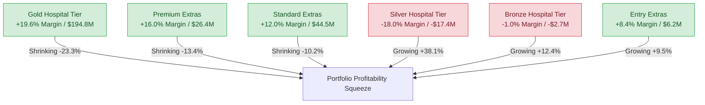

# HBF Actuarial Case Study: Financial & Portfolio Analysis (CY 2025 - 2026)

This report provides a detailed actuarial analysis of HBF’s Private Health Insurance (PHI) portfolio, covering Hospital and Extras products across calendar years 2025 and 2026. The analysis evaluates financial performance, product mix shifts, Risk Equalisation (RE) pool dynamics, claim drivers, and customer retention.

---

## Reproducibility & Pipeline Structure

The analysis presented in this report is fully reproducible. All calculations, data cleaning steps, and summaries are generated programmatically via the Python pipeline:

*   **Interactive Walkthrough:** [interactive_walkthrough.py](interactive_walkthrough.py) - A Jupyter-style interactive Python script divided by `# %%` cell markers for step-by-step walk-throughs in VS Code.
*   **Execution Runner:** [src/main.py](src/main.py) - Runs the entire pipeline, outputs summaries to the console, and writes the structured results to `analysis_output/`.
*   **Data Ingestion & Cleaning:** [src/loader.py](src/loader.py) - Loads the spreadsheet, cleans column name typos, and casts data types.
*   **Financial & Actuarial Calculations:** [src/financials.py](src/financials.py) - Calculates premiums, benefits, Risk Equalisation, loss ratios, margins, frequencies, and severities.
*   **Policy Movements & Roll-Forwards:** [src/movements.py](src/movements.py) - Performs the roll-forward reconciliation check and formats the movement pivots.
*   **Clinical & Seasonality Analysis:** [src/clinical.py](src/clinical.py) - Ranks clinical categories, evaluates Silver 0 vs. Gold 0 psychiatry claiming, and extracts quarterly seasonality.

All pipeline outputs are automatically saved to `analysis_output/` when you run the pipeline.

---

## Executive Summary: The "Subsidy Squeeze"

HBF’s portfolio is highly profitable overall, generating a total net margin of **$252.0M** over the two-year period (Hospital: **$174.8M**, Extras: **$77.2M**). However, a deep dive into product-level trends reveals a critical structural threat: **the profitable segments are shrinking rapidly, while the loss-making segments are growing.**

*   **Hospital Squeeze:** HBF’s Hospital margins are entirely supported by **Gold cover** ($194.8M net margin over 2 years), which cross-subsidizes net losses in **Bronze** (-$2.7M) and **Silver** (-$17.4M) covers. Yet, Gold policies are shrinking by **~20%**, while Bronze and Silver are growing by **12% to 38%**.
*   **Extras Squeeze:** Extras margins are driven by **Standard** ($44.5M) and **Premium** ($26.4M) covers. Premium and Standard are shrinking by **10% to 13%**, while the lower-margin **Entry** cover is growing by **9.5%**.
*   **Risk Equalisation (RE) Reversal:** stand-alone loss ratios are misleading. Stand-alone Bronze is highly profitable (gross loss ratio of ~50-55%), but after paying into the RE pool, it becomes a loss-maker. Conversely, Gold is highly unprofitable on a gross basis (~100-130% loss ratio) but becomes highly profitable after receiving RE receipts (~80-82% net loss ratio).
*   **Clinical Anomaly (Psychiatry in Silver 0):** Silver 0 is extremely unprofitable, with a net loss ratio of **169.5%** and a margin of **-$527.21** per policy per quarter. This is driven by **Psychiatry claims**, which represent **51.5%** of all Silver 0 benefits paid.
*   **Customer Attrition:** The membership decline in Gold and Standard Extras is driven primarily by **external cancellations** rather than internal downgrades, indicating customer retention and market competitiveness issues.

---

## 1. Portfolio Actuarial Summaries
*(Calculated in [src/financials.py](src/financials.py) and outputted to `analysis_output/hospital_actuarial_summary.csv` and `analysis_output/extras_actuarial_summary.csv`)*

### Hospital Product Actuarial Summary (CY 2025 - 2026)

| Hosp Tier | Excess ($) | Start Policies (2025Q1) | End Policies (2026Q4) | Growth % | Avg Qtr Prem/Pol | Qtr Freq / Policy | Severity per Episode | Bed Days / Episode | Qtr RE / Policy | Gross Loss Ratio | Net Loss Ratio | Margin % | Qtr Margin / Policy |
| :--- | :--- | :--- | :--- | :--- | :--- | :--- | :--- | :--- | :--- | :--- | :--- | :--- | :--- |
| **Bronze** | 0 | 41,595 | 37,912 | -8.9% | $422.02 | 0.069 | $3,224.71 | 1.63 | -$186.28 | 53.0% | 97.2% | 2.8% | $11.88 |
| **Bronze** | 250 | 17,193 | 23,119 | +34.5% | $531.21 | 0.100 | $3,010.89 | 1.52 | -$262.03 | 56.7% | 106.0% | -6.0% | -$31.77 |
| **Bronze** | 500 | 6,578 | 10,955 | +66.5% | $469.61 | 0.073 | $3,008.86 | 1.56 | -$267.70 | 46.5% | 103.5% | -3.5% | -$16.52 |
| **Gold** | 0 | 66,656 | 54,565 | -18.1% | $983.41 | 0.284 | $4,478.73 | 3.01 | $480.43 | 129.2% | 80.4% | 19.6% | $193.10 |
| **Gold** | 250 | 81,395 | 63,670 | -21.8% | $956.28 | 0.239 | $4,124.02 | 2.50 | $198.94 | 103.1% | 82.3% | 17.7% | $169.61 |
| **Gold** | 500 | 7,898 | 7,875 | -0.3% | $902.58 | 0.207 | $3,903.61 | 2.24 | -$18.66 | 89.6% | 91.6% | 8.4% | $75.56 |
| **Silver** | 0 | 1,765 | 2,270 | +28.6% | $758.21 | 0.417 | $3,137.02 | 3.15 | $22.14 | 172.5% | 169.5% | -69.5% | -$527.21 |
| **Silver** | 250 | 8,207 | 10,045 | +22.4% | $770.68 | 0.216 | $3,262.30 | 2.33 | -$158.89 | 91.3% | 111.9% | -11.9% | -$91.81 |
| **Silver** | 500 | 4,430 | 6,498 | +46.7% | $710.39 | 0.184 | $2,856.16 | 2.13 | -$220.08 | 74.2% | 105.2% | -5.2% | -$36.60 |

> [!NOTE]
> *   **Gross Loss Ratio (LR)** = Claims / Premiums
> *   **Net Loss Ratio (LR)** = (Claims - RE Received) / Premiums
> *   **Margin %** = (Premiums - Claims + RE Received) / Premiums
> *   *Policy counts, premiums, RE, and margins are presented on a quarterly basis.*

### Extras Product Actuarial Summary (CY 2025 - 2026)

| Extras Tier | Start Policies (2025Q1) | End Policies (2026Q4) | Growth % | Avg Qtr Prem/Pol | Qtr Services / Policy | Severity per Service | Loss Ratio (LR) | Margin % | Qtr Margin / Policy |
| :--- | :--- | :--- | :--- | :--- | :--- | :--- | :--- | :--- | :--- |
| **Entry** | 71,706 | 78,514 | +9.5% | $122.42 | 1.9 | $58.42 | 91.6% | 8.4% | $10.32 |
| **Standard** | 191,347 | 171,760 | -10.2% | $256.10 | 3.9 | $57.14 | 88.0% | 12.0% | $30.70 |
| **Premium** | 42,409 | 36,738 | -13.4% | $522.39 | 6.3 | $69.90 | 84.0% | 16.0% | $83.80 |

---

## 2. Key Actuarial Insights

### 1. Risk Equalisation Reverses Stand-alone Product Profitability
Under Australia's Risk Equalisation (RE) framework, funds receive payouts for older, high-claiming cohorts and pay into the pool for younger, low-claiming cohorts.
*   **Gold Cross-Subsidies:** Gold 0 has a gross loss ratio of **129.2%** (unsustainable on its own). However, it receives a massive RE receipt of **$480.43/policy/quarter**, reducing its net loss ratio to **80.4%** and making it HBF’s most profitable hospital tier (19.6% margin).
*   **Bronze / Silver RE Drag:** Bronze 250 has a healthy gross loss ratio of **56.7%** (a 43.3% gross margin). However, because it attracts a young demographic, HBF must pay **$262.03/policy/quarter** into the RE pool. This pushes the net loss ratio to **106.0%**, resulting in a net **loss** of **-6.0%** for HBF.
*   **Strategic Dilemma:** HBF cannot simply expand its Bronze products to grow profits. Stand-alone growth in Bronze creates an RE cash drain that exceeds its underwriting profits, leading to net losses.

### 2. Premium Pricing Anomalies (Hosp Excess Mix Effect)
Average premiums per policy for Bronze and Silver do not follow the expected order (where lower excess = higher premium):
*   **Bronze 250 ($531.21)** > **Bronze 500 ($469.61)** > **Bronze 0 ($422.02)**
*   **Silver 250 ($770.68)** > **Silver 0 ($758.21)** > **Silver 500 ($710.39)**
*   **Actuarial Explanation:** This is a policy-mix effect. $0 excess options are heavily purchased by younger, single members to avoid the Medicare Levy Surcharge (MLS). These single policies have low premiums. The $250 excess option is heavily dominated by couples and families (covering multiple adults). Although their per-adult premium is lower, their total *policy* premium is much higher because they cover multiple people. Gold follows the expected order because it is dominated by single seniors with a uniform policy structure.

### 3. Silver 0 Clinical Claiming Anomaly: Psychiatry
Silver 0 is a major financial leak, losing **$527.21 per policy per quarter** (-69.5% margin).
*   **Mental Health Waiver Effect:** Psychiatry claims represent **51.5%** ($11.26M out of $21.88M) of all Silver 0 hospital claims.
*   **Actuarial Explanation:** In Australia, members on low-tier covers (like Silver) can access a one-time "Mental Health Waiver" to upgrade and bypass waiting periods for psychiatric treatment. Members who require expensive, long-term psychiatric treatment (average stay of **3.6 days per episode**) choose Silver 0 because it has no excess, resulting in a severe concentration of high-cost psychiatric claims in this specific tier.

### 4. Extras Limit Reset & Seasonality
Extras claims show a distinct quarterly seasonal pattern:
*   **Q1 Peak:** Extras claims are highest in **Q1** ($72.2M in 2025Q1, $69.6M in 2026Q1) and lowest in **Q3** ($64.1M in 2025Q3, $62.0M in 2026Q3).
*   **Actuarial Explanation:** HBF’s extras benefits have annual limits that reset on a calendar year basis (January 1st). This triggers a surge in dental (which represents **64.7%** of all extras claims) and optical claiming in the first half of the year as members utilize their refreshed limits.

---

## 3. Membership & Migration Trends
*(Reconciled and pivoted in [src/movements.py](src/movements.py) and outputted to `analysis_output/hospital_movements_pivot.csv` and `analysis_output/extras_movements_pivot.csv`)*

The change in policy counts reconciles perfectly with the reported movements. However, the source of membership decline is concerning.

### Hospital Product Net Movements (CY 2025 - 2026)

| Product Tier | New Sales | Cancellations | Net External | Switched On | Switched Off | Net Internal | Total Net Change |
| :--- | :---: | :---: | :---: | :---: | :---: | :---: | :---: |
| **Bronze** | +30,921 | -24,682 | **+6,239** | +5,476 | -3,636 | **+1,840** | **+8,079** |
| **Silver** | +6,002 | -4,934 | **+1,068** | +6,322 | -1,904 | **+4,418** | **+5,486** |
| **Gold** | +7,447 | -37,553 | **-30,106** | +20,275 | -26,533 | **-6,258** | **-36,364** |
| **Total** | **+44,370** | **-67,169** | **-22,799** | **+32,073** | **-32,073** | **$0** | **-22,799** |

### Extras Product Net Movements (CY 2025 - 2026)

| Product Tier | New Sales | Cancellations | Net External | Switched On | Switched Off | Net Internal | Total Net Change |
| :--- | :---: | :---: | :---: | :---: | :---: | :---: | :---: |
| **Entry** | +30,247 | -24,750 | **+5,497** | +4,815 | -2,512 | **+2,303** | **+7,800** |
| **Standard** | +27,232 | -49,013 | **-21,781** | +5,017 | -6,848 | **-1,831** | **-23,612** |
| **Premium** | +2,834 | -9,063 | **-6,229** | +2,789 | -3,261 | **-472** | **-6,701** |
| **Total** | **+60,313** | **-82,826** | **-22,513** | **+12,621** | **-12,621** | **$0** | **-22,513** |

### Key Migration Findings:
1.  **Retention, Not Just Downgrading:** The loss of 36,364 Gold policies is **82.8%** driven by **external cancellations (-30,106)** rather than internal downgrades to Silver/Bronze (-6,258). Similarly, Standard Extras lost 21,781 members externally. This indicates that members are leaving HBF completely (due to price or competitive offers) rather than shifting to cheaper HBF tiers.
2.  **Internal downgrades are material:** Net internal transfers still show a shift of **-6,258** from Gold and positive flows into Silver (**+4,418**) and Bronze (**+1,840**), accelerating the loss of high-margin members.
3.  **Data Quality Observation:** In 2026Q4, Gold 250 recorded a massive spike in internal movements: **-16,538 Move Off** and **+16,228 Move On**, with a net change of only **-310**. This extreme gross volume (representing ~25% of the product base) is highly characteristic of an administrative database migration (e.g. merging product codes or fixing system records) rather than independent customer behavior.

---

## 4. Clinical Claim Category Insights
*(Analyzed in [src/clinical.py](src/clinical.py) and outputted to `analysis_output/top_hospital_claim_categories.csv`, `analysis_output/top_extras_claim_categories.csv`, `analysis_output/silver_0_claim_mix.csv`, and `analysis_output/claims_seasonality.csv`)*

### Top 10 Hospital Claim Categories (CY 2025 - 2026)

| Clinical Category | Benefits Paid ($) | Total Episodes | Bed Days | Share of Hospital Claims | Avg Benefit / Episode |
| :--- | :--- | :--- | :--- | :--- | :--- |
| **Musculoskeletal & Connective** | $343.2M | 35,289 | 117,975 | 23.5% | $9,725.69 |
| **Circulatory System** | $205.2M | 16,756 | 64,108 | 14.0% | $12,247.55 |
| **Psychiatry** | $153.8M | 69,419 | 277,752 | 10.5% | $2,215.68 |
| **Digestive System** | $122.0M | 43,145 | 77,954 | 8.3% | $2,826.52 |
| **Endocrine, Nutritional & Met** | $54.5M | 7,225 | 18,831 | 3.7% | $7,545.33 |
| **Respiratory System** | $50.6M | 10,103 | 42,284 | 3.5% | $5,004.85 |
| **Eye** | $44.1M | 16,425 | 17,127 | 3.0% | $2,682.25 |
| **Skin, Subcutaneous & Breast** | $42.5M | 9,196 | 22,993 | 2.9% | $4,620.44 |
| **Female Reproductive** | $41.1M | 8,970 | 16,314 | 2.8% | $4,577.48 |
| **Nervous System** | $39.6M | 6,471 | 28,014 | 2.7% | $6,116.37 |

*   **Musculoskeletal and Circulatory** represent **37.5%** of all claims, with very high severities ($9.7k and $12.2k per episode). These are typical senior-heavy treatments (joint replacements, cardiac procedures) concentrated in Gold covers.
*   **Psychiatry** is the third-largest hospital cost category, representing **10.5%** of claims but having by far the highest number of bed days (**277,752** days, representing **29.9%** of all bed days in the portfolio). This reflects the high-frequency, long-duration nature of psychiatric admissions.

### Extras Claim Categories (CY 2025 - 2026)

| Extras Category | Benefits Paid ($) | Total Services | Share of Extras Claims | Avg Benefit / Service |
| :--- | :--- | :--- | :--- | :--- |
| **DENTAL** | $345.1M | 4,688,349 | 64.7% | $73.60 |
| **OPTICAL SPECS** | $56.7M | 704,238 | 10.6% | $80.56 |
| **PHYSIOTHERAPY** | $35.8M | 1,386,291 | 6.7% | $25.84 |
| **AMBULANCE** | $25.8M | 36,890 | 4.8% | $700.70 |
| **CHIROPRACTIC/OSTEOPATHY** | $21.2M | 1,011,377 | 4.0% | $20.97 |

*   **Dental** dominates Extras claims, accounting for **64.7%** of benefits.
*   **Ambulance** claims have the highest severity (**$700.70** per service), which is a standard flat-rate transport fee, whereas other extras are per-visit rebates.

---

## 5. Strategic Recommendations

Based on these actuarial findings, HBF should consider several strategic interventions to stabilize margins and address customer attrition:

1.  **Gold Product Retention Campaign:**
    Since Gold is HBF's primary margin generator, the fund must address the **-30,106 external cancellations**.
    *   *Action:* Conduct customer experience and exit surveys to understand why Gold members are cancelling. Introduce loyalty benefits, premium service features, or age-based premium discounts to retain older cohorts.
2.  **Reprice Bronze and Silver Products:**
    Bronze and Silver covers currently run net losses (-6.0% and -11.9% for the $250 excess tiers) because underwriting profits are wiped out by payments into the Risk Equalisation pool.
    *   *Action:* Increase premiums for Bronze and Silver to reflect their true post-RE costs, or redesign these products to adjust the target demographic mix.
3.  **Address the Silver 0 Psychiatry Leak:**
    Silver 0 has an unsustainable **169.5% net loss ratio** due to the concentration of psychiatric claims.
    *   *Action:* Review the pricing of Silver 0, introduce or adjust the excess levels, or coordinate with the clinical network to manage the cost of psychiatric admissions (e.g. transitioning to outpatient or community care models where appropriate).
4.  **Redesign Extras Annual Limits:**
    The Q1 dental and optical claiming peak indicates a rush to use limits upon reset.
    *   *Action:* Introduce rolling limits (e.g., limits that reset on the member's join date anniversary rather than a flat calendar year basis) to smooth cash outflows and claims administration throughout the year.
5.  **Address Extras Customer Attrition:**
    The loss of 21,781 Standard Extras members to external cancellations represents a significant customer drop-out rate.
    *   *Action:* Implement bundled discounts (combining hospital and extras) to increase policy stickiness, and promote preventative care benefits (e.g. gap-free dental checkups) to increase the perceived value of extras.
